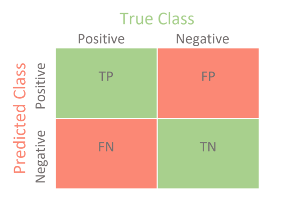

```{r libraries, message=FALSE,warning=FALSE,echo=FALSE}
library(tidyverse)
library(tidymodels)
library(psych)
library(plotly)
library(gridExtra)
library(doParallel)
library(skimr)
```

```{r read in data}
data<-read.csv("train.csv")
test<-read.csv("test.csv")
```

# Data Preparation
Most of the variables are not of the proper type, so I will convert character variables
to factors and recode some of them to have meaningful levels.

```{r convert to factor}
data<-data%>%
    mutate_if(is.character,as.factor)%>%
    mutate_at(c("Driving_License","Previously_Insured","Response","Region_Code",
                "Policy_Sales_Channel"),as.factor)

data$Response<-recode_factor(data$Response, `0` = "No",
                              `1` = "Yes")
data$Vehicle_Damage<-recode_factor(data$Vehicle_Damage,No="No Damage",
                                    Yes="Damage")
data$Previously_Insured<-recode_factor(data$Previously_Insured,`0`="No Insurance",
                                        `1`="Insurance")
data$Driving_License<-recode_factor(data$Driving_License,`0`="No DL",
                                     `1`="Has DL")

test<-test%>%
    mutate_if(is.character,as.factor)%>%
    mutate_at(c("Driving_License","Previously_Insured","Region_Code",
                "Policy_Sales_Channel"),as.factor)

test$Vehicle_Damage<-recode_factor(test$Vehicle_Damage,No="No Damage",
                                    Yes="Damage")
test$Previously_Insured<-recode_factor(test$Previously_Insured,`0`="No Insurance",
                                        `1`="Insurance")
test$Driving_License<-recode_factor(test$Driving_License,`0`="No DL",
                                     `1`="Has DL")
```
## Create validation/training data sets
Since this particular set of data already has a separate csv file for the test data
set, I will split the training dataset to create a validation set. So as to be able
to test the models and avoid overfitting.

``` {r data split}
set.seed(1111)
split<-initial_split(data,prop=.7,strata=Response)
train<-training(split)
valid<-testing(split)

```


#Exploratory Data Analysis

```{r data summary}
skim(train)
```

This summary shows a few things of interest. First is that there are no missing value. Second is that 
the outcome variable is quite unbalanced with the majority of individuals being not interested (~88%).
This can have an effect on model performance, and various sampling techniques (e.g. upsample/smote)
will be implemented. The Driving_license predictor is also very unbalanced with a tiny
subset of individuals having no driver's license, thus this predictor may not be very
useful. There are also a relatively small proportion of individuals in this sample with
a car age greater than 2 years. The other factor variables seem to have a relatively
even balance of responses in their different levels. The numeric variables such as 
age seem to be within a reasonable range. Both Region_Code and Policy_Sales_Channel
have many unique values so some of the less frequent categories may need to be consolidated
in order to reduce dimensionality and uninformative categories.

## EDA of Numeric Predictors
```{r univariate numeric analysis,warning=FALSE,message=FALSE,cache=TRUE}
library(GGally)

train%>%
  select(Age,Annual_Premium,Vintage,Response)%>%
  ggpairs(mapping=aes(color=Response,alpha=.5),title="Numeric Predictors as a Function of Response")+
  theme(plot.title = element_text(hjust=.5))+
  scale_color_brewer(type="qual",palette="Dark2")+
  scale_fill_brewer(type="qual",palette="Dark2")


```

This plot shows that age has a skewed bimodal distribution for "No" respondents with the majority of individuals
being around 25 years of age, and another concentration of individuals around 40 years of age.
For "Yes" respondents, the distribution is less bimodal with the majority of responses centered
around customers who are 40 years old. Examining the boxplot of Age shows that 
the median age of customers responding yes is older than those who responded no.
The annual premium is also skewed with individuals who responded yes and no seemingly having a similar
distribution of premiums. As was seen in the summary there is a maximum annual premium of 540,165, 
which is far above the median value of 31,662. The number of days with the company is an almost uniformly
distributed predictor with no difference between "Yes" and "No" customers. The correlations among the
predictors shows that there is little to no relationship among these numeric predictors indicating
the absence of multicolinearity. This is important to keep in mind as the response variable is
binary and thus logistic regression is a prime model of interest and one of the model assumptions
is that there is no multicolinearity.
 

## Categorical Bar Charts
### Insurance Expansion as a function of vehicle age and current Insurance status

```{r categorical variables}
catp1<-ggplot(data=train,aes(x=Vehicle_Age,fill=Response))+
    geom_bar(position="dodge")+
    scale_fill_brewer(type="qual",palette="Dark2")+
    facet_wrap(~Previously_Insured)+
    labs(title="Car Insurance as a Function of Current Insurance and Vehicle Age",
         x="Vehicle Age",
         fill="Purchase New \nInsurance?")+
    theme(plot.title = element_text(hjust=.5))
ggplotly(catp1)

```

This plot indicates that customers with vehicle insurance are not indicating that they
want to purchase car insurance. This is seems quite intuitive and unsurprising so it is
good that the data backs this notion up. Among those without car insurance, it seems
that customers with cars between 1 and 2 years old purchase car insurance much more frequently than customers
with cars that are less than 1 year or greater than 2 years old.


### Insurance expansion as a function of gender and driver's license possesion

```{r categorical variables 2}
catp2<-ggplot(data=train,aes(x=Gender,fill=Response))+
    geom_bar(position="dodge")+
    facet_wrap(~Driving_License)+
    scale_fill_brewer(type="qual",palette="Dark2")+
      labs(title="Car Insurance as a Function of Gender and Driver's License (DL)",
         fill="Purchase New \nInsurance?")+
    theme(plot.title = element_text(hjust=.5))
ggplotly(catp2)
```

This plot first and foremost shows that there are not many customers without a Driver's License.
In addition to this there is not much difference among men and women in terms of responding yes and no.
Both men and women respond yes and no in similar proportions. Thus possession of a driver's
license is not a very useful predictor since only one level has the majority of observations.

### Boxplots of insurance expansion as a function of vehicle age and current insurance status
Since customer Age, Vehicle Age, and current car insurance seem to be useful predictors,
I want to examine how all of these interact.

```{r boxplots,warning=FALSE}
bp1<-ggplot(data=train,aes(x=Vehicle_Age,y=Age,fill=Response))+
    geom_boxplot(position=position_dodge(1))+
    facet_wrap(~Previously_Insured)+
    scale_fill_brewer(type='qual',palette="Dark2")+
        labs(title="Car Insurance as a Function of Age, Current Insurance, and Vehicle Age",
         x="Vehicle Age",
         fill="Purchase New \nInsurance?")+
    theme(plot.title = element_text(hjust=.5))
ggplotly(bp1)%>%
    layout(boxmode="group")

```

This plot indicates that the age distribution is quite similar among customers who respond
yes or no to new car insurance purchases across both vehicle age and current car insurance
status. The main difference in yes and no responses comes with customers who do not currently
have car insurance and have a vehicle less than one year old. In this case, customers
who respond yes seem to be older than those who respond no.

## EDA Summary
Using these plots and summary techniques I was able to glean a few interesting things from the data.

1. There is a large class imbalance in the outcome variable (Response)
2. Age, Vehicle Age, and Current Car Insurance Status seem to be informative predictors
3. Multicolinearity among the predictors is not present
4. Some categorical predictors have either few responses in one category (Driver's License) or have many
   categories that need to be consolidated (REgion code and Policy Sales Channel)


# Machine Learning Models

For this data set I am going to be comparing 3 different models, logistic regression, penalized logistic
regression, and random forest. All 3 models can handle this binary classification problem but
have various pros and cons associated with them.

## Logistic Regression

* Pros
      + Easy interpretation and implementation
      + Computationally efficient
      + Less inclined to overfit low dimensional data
* Cons
      + Has assumptions that must be met to have reliable parameter estimates
      + Tends to overfit high dimensional data
      + Performs best when there is a linear relationship between predictors and logit of outcome variable
      + Doesn't naturally capture complex relationships among predictors (e.g. interactions must be specified)

## Penalized Logistic Regression

* Pros
      + Same as logistic regression but can accomodate highly correlated predictors with penalty/mixture 
        parameters
      + Avoids overfitting with high dimensional data
      + Acts as an automatic feature selection method
* Cons
      + Additional hyperparameters require extra model tuning
      + Results are not as easy to interpret
      + It can be difficult to understand why certain predictors are penalized

## Random Forest

* Pros
      + Very powerful predictive capabilities due to ensemble of trees and random selection of predictors
      + Automatically calculates interactions between predictors
      + Can examine non-linear relationships between predictors and outcome variable
* Cons
      + Computationally intensive due to large number of trees being aggregated
      + Requires hyperparameter tuning that takes additional time
      + Lack of model interpretability
  
# Data Preparation
To prepare the data for modelling I first update the role of the ID variable so that it 
is included in the dataset but is not used in the modelling. Then I use step other to clump together 
categories in factors that have few observations (less than 1% of the data). This will help reduce
the dimensionality of the data and increase how informative factor levels with few observations are. 
Step novel prepares the data set so that if the test data set has new category levels not seen in the
training data set, these additional levels with be stored under a "new" label. This simply helps
models not experience any warnings or errors when they are applied to the test data set.
I apply a logarithmic transformation of the annual premium predictor as it is heavily skewed, and 
I did not want to remove a substantial amount of outliers.  
I normalize the data (subtract each value from the mean and divide by the SD) to make sure all predictors 
are on the same scale so large values don't incorrectly bias parameter estimates. Then the logistic 
regression models require the  factor predictors to be converted to dummy variables. Next I use step nsv 
to remove any predictors that are highly unbalanced such as the driver's license predictor. Using the freq_cut
argument I specify the ratio of the most frequent level to the second most frequent value. I specify this
ratio to be 99 to 1 (i.e. out of 100 samples, 99 are for the first class and 1 is for the second class)
so that a predictor with a ratio greater than this is removed. This is more 
conservative than the default value as I lean towards keeping data when I can help it. Finally, I
create cross-validation folds which will be used to further reduce the likelihood of
the models overfitting.

```{r prepare for modelling,warning=FALSE,message=FALSE}
levels(train$Response)<-c("No","Yes")
insurance_recipe<-recipe(Response~.,data=train)%>%
    update_role(id,new_role = "ID")%>%
    step_other(all_nominal_predictors(),threshold=.01)%>%
    step_novel(all_nominal_predictors())%>%
    step_log(Annual_Premium)%>%
    step_normalize(all_numeric_predictors())%>%
    step_dummy(all_nominal_predictors())%>%
    step_nzv(all_predictors(),freq_cut = 99/1)

# create cross validation sets to reduce model variance
cv_folds<-vfold_cv(train,v=5)
```

## Setting up model engines and hyperparameter tuning

Using tidymodels for my model specification I set the mode to classification for all models
(although this is not necessary for logistic regression). For the penalized logistic regression,
I use the glmnet engine which fits a logistic regression with a mixture of Lasso (L1) and Ridge (L2)
regularization. Lasso regularization adds a an extra term to the logistic regression loss function
that multiplies a penalty term (aka alpha) by the absolute value of the model coefficients.
Ridge regularization on the other hand, adds an extra term that multiplies a penalty term by the 
squared value of the model coefficients. Ridge regularization is preferable when all coefficients
should be incorporated into the model as it "pushes" less informative coefficient values close to zero. 
Lasso regularization forces these less informative coefficient values to be zero. Glmnet has the
ability to combine the two of these regularization techniques to make an elastic net regularization.
This results in some coefficients being shrunk towards zero (L2) and others being set to zero (L1).
There are two hyperparameters that I am going to tune with the penalized model, penalty and mixture.

* The penalty parameter (alpha) affects how much coefficient values are minimized
* The mixture parameter (lambda) ranges from 0 to 1 with 0 being full Ridge regularization and 1 being full
  Lasso regularization 
  
For the Random Forest model, I am using the ranger engine as it is an efficient implementation
of the random forest model. There are two hyperparameters I am tuning for this model mtry and trees.

* mtry refers to the number of predictors that the random forest model will consider at each split.
* trees refers to how many trees are to be used 
    
```{r creating model specifications}

lr_mod<-logistic_reg()%>%
    set_mode("classification")%>%
    set_engine("glm")

lr_mod_RL<-logistic_reg(penalty=tune(),mixture=tune())%>%
    set_engine("glmnet")%>%
    set_mode("classification")

rf_mod<-rand_forest(mtry=tune(),trees=tune())%>%
    set_mode("classification")%>%
    set_engine("ranger")
    
```


## Specifying hyperparameter tuning grid
For the hyperparameter tuning grid I am letting the tune function specify the range
for the penalized logistic regression. This tidymodels function selects reasonable
endpoints for each parameter. For example, the mixture parameter has a range from 0-1. With 7 levels 
(including endpoints) for each parameter there will be 49 models compared.

For the random forest model I specify the hyperparameter endpoints as these are values I am interested in
testing. There are a total of 4 levels across the tuning grid for the random forest with
all parameter combinations implemented resulting in 16 models.

```{r specify tuning grid}
lr_grid<-grid_regular(penalty(),
                      mixture(),
                      levels=7)
rf_grid<-grid_regular(mtry()%>%range_set(c(1, 10)),
                      trees()%>%range_set(c(500,2000)),
                      levels=4)
```

### Making workflow to allow easy interchange of the models

```{r create workflow}
insurance_wf<-workflow() %>%
    add_recipe(insurance_recipe,
               blueprint = hardhat::default_recipe_blueprint(allow_novel_levels = TRUE))%>%
    add_model(lr_mod)
```

# Model Fitting
## Logistic Regression Model Fit
For the model fits I am collecting 3 different metrics F-score, Accuracy and the
roc_auc score. To understand how these metrics are calculated, it is necessary to
understand confusion matrices. Confusion matrices (like the one below) are a way of displaying the results
of a classification problem to assess model performance. 



In this example the model predictions are presented on the Y-axis and the actual
data values are presented on the X-axis. The positive and negative values are arbitrary names that 
correspond to the outcome variable classes (e.g. "No" and "Yes"). There are 4 different classification outcomes:

* True Positive (TP): When the model correctly predicts an observation as Positive
* True Negative (TN): When the model correctly predicts an observation as Negative
* False Positive (FP): When the model incorrectly predicts an observation as Positive when 
  it's true value is Negative (aka type I error)
* False Negative(FN): When the model incorrectly predicts an observation as Negative when it's true value is
  Positive (aka type II error)
  
With these values, various metrics can be calculated that can be used to evaluate different weakness in a 
model fit

* Recall (aka Sensitivity or True Positive Rate): This is an important metric when the reduction of false
  negative is key to the question of interest 
     $$ \frac{TP}{TP+FN} $$
  
* Specificity: This metric is important when correctly categorizing the negative category is of the utmost
  importance  
    $$ \frac{TN}{TN+FP}$$
    
* Precision: This metric is important when false positives are undesireable and we want to be confident in
  the positive predicted values 
$$\frac{TP}{TP+FP}$$
  
* Accuracy: The most common metric for classification model performance as it measures how well the model  
  correctly classifies observations. Not a good metric when class imbalance is a concern.
$$ \frac{TP+TN}{TP+FN+FP+TN}$$
    
* Receiver Operating Characteristic Curve/Area Under the Curve (ROC/AUC): The ROC curve plots the true
  positive rate against the false positive rate. The false positive rate is calculated as 1-Specificity. 
  
  
  
  This is a useful measure in classification problems as it can measure model biases at different thresholds.
  The AUC is a related metric that measures the area under this entire curve to provide an aggregate
  measure across all classification thresholds. This is the value returned by the roc_auc metric.
  This can range from 0-1 with 0 indicating the model predictions are all incorrect, and a value of
  1 indicating the model has perfect classification. 

* F$\beta$-Score (f_meas): This metric is when we are interested in the tradeoff of precision and
  recall.$$\left(1+\beta^{2}\right)*\frac{Precision*Recall}{\beta^{2}*Precision+Recall}$$ The $\beta$
  parameter can allow the user to specify the importance of recall over precision. For example, a value of 2
  indicates that recall is twice as important as precision. If the $\beta$ value is 1 then the F1-score is
  calculated which is the harmonic mean of precision and recall and is useful when a balance between these two
  metrics is required. This is of particular interest when false negatives are a concern.
    $$\frac{2*Precision*Recall}{Precision+Recall}$$
    

  


```{r Logistic Regression Model fit,warning=FALSE,message=FALSE,eval=FALSE}
lr_fit_train<- insurance_wf%>%
    fit_resamples(resamples=cv_folds,
                  metrics = metric_set(
                      f_meas,
                      accuracy,
                      roc_auc),
                  control = control_resamples(save_pred = TRUE))

saveRDS(lr_fit_train,"lr_basicfit.rds")
```

## Penalized Logistic Regression Model fit-hyperparameter tuning

```{r ridge regression model,warning=FALSE,message=FALSE,eval=FALSE}
insurance_wf<-update_model(insurance_wf,lr_mod_RL)
lr_pen_fit<-insurance_wf%>%
    tune_grid(resamples=cv_folds,
                  grid=lr_grid,
                      metrics = metric_set(
                      f_meas,
                      accuracy,
                      roc_auc),
                  control=control_grid(save_pred=TRUE))
saveRDS(lr_pen_fit,"lr_pen_fit.rds")

```

```{r read in Ridge/Lasso Regression Model,echo=FALSE}
lr_fit_train<-readRDS("lr_basicfit.rds")
lr_pen_fit<-readRDS("lr_pen_fit.rds")
RF_fit<-readRDS("RF_mod_Grid.rds")

```

## Penalized Regression Hyperparameter fit evaluation

To 
```{r Ridge/Lasso Regression hyperparamter evaluation}
lr_pen_fit %>%
  collect_metrics() %>%
  mutate(mixture = factor(mixture)) %>%
  filter(mean>.8)%>%
  ggplot(aes(penalty, mean, color = mixture)) +
  geom_line(size = 1.2, alpha = 0.5) +
  geom_point(size = 2) +
  facet_wrap(~ .metric, scales = "free_y", nrow = 2) +
  scale_x_log10(labels = scales::scientific,limits=c(NA,.05)) +
  scale_color_viridis_d(begin = .9, end = 0)

```

This set of plots indicates that a mixture value of zero seems to provide the best
fitting model across all penalty values for accuracy and the F-measure. Mixture values other than
zero achieve a similar level of accuracy and F-score when the penalty is large. In relation 
to the AUC value, the model with a mixture a value of 0 does worse until the penalty 
value is relatively large, and then it is the best. That being said the difference in
performance between these hyperparameter values is very small, differing by values in
the ten thousandths for the most part. Since AUC is the main metric of interest, I will
put more weight on that in making my modelling choice.

```{r best penalized logistic regression}
lr_pen_best<-select_best(lr_pen_fit,metric = "roc_auc")
show_best(lr_pen_fit,metric="roc_auc")
```


This function shows that the best model based on AUC is one with a mixture of 1/6
and a penalty of 1e^-10 which will be the penalized logistic regression model I use
going forward.

## Random Forest Model Fit
Although the random forest model does not require dummy variables I will still use
the same recipe as the logistic regression for the sake of simplicity.

```{r random forest model,warning=FALSE,message=FALSE,eval=FALSE}
set.seed(1234)
insurance_wf<-update_model(insurance_wf,rf_mod)
RF_fit<-insurance_wf%>%
    tune_grid(resamples=cv_folds,
                  grid=rf_grid,
                  metrics = metric_set(
                      f_meas,
                      accuracy,
                      roc_auc),
                  control=control_grid(save_pred = TRUE)
              )
saveRDS(RF_fit,"RF_mod_Grid.rds")

```

## Random Forest Hyperparameter fit evaluation

```{r RF model hyperparamter visualization}
RF_fit %>%
  collect_metrics() %>%
  mutate(mtry = factor(mtry)) %>%
  ggplot(aes(trees, mean, color = mtry)) +
  geom_line(size = 1.2, alpha = 0.5) +
  geom_point(size = 2) +
  facet_wrap(~ .metric, scales = "free", nrow = 2) +
  scale_color_viridis_d(begin=.9,end=0)

```
This plot shows how performance metrics change as a function of the number of trees
and the number of randomly sampled predictors at each split. Across all metrics an
mtry value of 7 or 10 performs the worst and is relatively unaffected by the number
of trees. mtry of 1 and 4 are nearly equivalent for accuracy and the f1-score with the 
mtry of 1 possibly being slightly better. With AUC, mtry of 4 consistently outperforms
the other mtry possibilities. The number of trees seems to have little influence
on the model performance, with a slight increase from 500-1000 trees but above that
seems to offer no benefit. The table below will show the best parameter combinations
based on AUC.

```{r RF best model selection}
rf_best_fit<-select_best(RF_fit,metric="roc_auc")
show_best(RF_fit,metric="roc_auc")
```


# Model comparison
we will begin our model comparison by examining the confusion matrices and then
examine the ROC curve.

```{r collect data for confusion matrices}
lr_pred<-
    lr_fit_train%>%
    collect_predictions()

lr_pen_pred<-
    lr_fit_train%>%
    collect_predictions(parameters=lr_pen_best)

rf_pred<-
    RF_fit%>%
    collect_predictions(parameters=rf_best_fit)
```

## Confusion Matrices
```{r}
cm_lr<-lr_pred%>%
    conf_mat(Response,.pred_class)%>%
    autoplot(type='heatmap')+
    ggtitle("Logistic Regression")
cm_lr_pen<-lr_pen_pred%>%
    conf_mat(Response,.pred_class)%>%
    autoplot(type='heatmap')+
    ggtitle("Penalized Regression")
cm_rf<-rf_pred%>%
    conf_mat(Response,.pred_class)%>%
    autoplot(type='heatmap')+
    ggtitle("Random Forest")
    
grid.arrange(cm_lr,cm_lr_pen,cm_rf,ncol=3,heights=c(1,1))
```

This plot of confusion matrices demonstrates a huge problem across all the models.
The models are quite good at capturing true positives (a predicted "No" response
in agreement with the actual data) but fails to capture the true negatives (a predicted
"Yes" response in agreement with the actual data). All the models make an abundance
of false positives (a predicted "No" response when the data is a "Yes" response)
which is quite problematic since I am interested in developing a model that can
capture the "Yes" responses. This is due to the unbalanced nature of the outcome
variable. To address this I will implement upsampling, downsampling and smote sampling
to find a method to address this. I will examine the specificity and ROC values of
the already fit models to determine which model I will test these different sampling methods with
first. 

```{r collect specificity and ROC values}
lr_spec<-
    lr_pred%>%
    spec(Response,.pred_class)%>%
    mutate(Model="Logistic Regression")
lr_pen_spec<-
    lr_pen_pred%>%
    spec(Response,.pred_class)%>%
    mutate(Model="Penalized Logistic Regression")
rf_spec<-
    rf_pred %>%
    spec(Response,.pred_class)%>%
    mutate(Model="Random Forest")

lr_auc<-
    lr_pred%>%
    roc_auc(Response,.pred_No)%>%
    mutate(Model="Logistic Regression")
lr_pen_auc<-
    lr_pen_pred%>%
    roc_auc(Response,.pred_No)%>%
    mutate(Model="Penalized Regression")
rf_auc<-
    rf_pred%>%
    roc_auc(Response,.pred_No)%>%
    mutate(Model="Random Forest")
    
```

```{r Compare Specificity and ROC}
spec_plot<-bind_rows(lr_spec,lr_pen_spec,rf_spec) %>% 
  ggplot(aes(x=.estimate,y = Model, color = as.factor(Model))) + 
  geom_point(size=3)+
  scale_color_brewer(type="qual",palette="Dark2")+
  labs(title="Specificity Across Models",x="Specificity",color="Model")+
  theme(plot.title = element_text(hjust=.5))

auc_plot<-bind_rows(lr_auc,lr_pen_auc,rf_auc) %>% 
  ggplot(aes(x=.estimate,y = Model, color = as.factor(Model))) + 
  geom_point(size=3)+
  scale_color_brewer(type="qual",palette="Dark2")+
  labs(title="AUC Across Models",x="AUC",color="Model")+
  theme(plot.title = element_text(hjust=.5))


grid.arrange(spec_plot,auc_plot,nrow=2)
```


These plots show that the random forest model has both a slightly better AUC and
specificity than the other models. However given the additional complexity of the
random forest model, the increase in performance is negligible. Therefore, I will
be using the logistic regression model to test whether upsampling, downsampling or
smote sampling will best address the class imbalance.

# Class Imbalance Modelling
## Add in sampling steps to recipes

```{r update workflows for different sampling techniques}
library(themis)

upsamp_rec<-insurance_recipe%>%
  step_upsample(Response,over_ratio = tune())

downsamp_rec<-insurance_recipe%>%
  step_downsample(Response,under_ratio = tune())

smote_rec<-insurance_recipe%>%
  step_smote(Response,over_ratio=tune(),neighbors = tune())


```


## Creating sampling tuning grids

```{r create sampling tuning grids}
upsamp_grid<-grid_regular(over_ratio()%>%range_set(c(.5,1.5)),
                          levels=11)
downsamp_grid<-grid_regular(under_ratio()%>%range_set(c(.5,1.5)),
                            levels=11)
smote_grid<-grid_regular(over_ratio()%>%range_set(c(.5,1.5)),
                         neighbors()%>%range_set(c(2,12)),
                         levels=11)

```

## Upsample model 

```{r upsample model fit,eval=FALSE}
insurance_wf<-insurance_wf%>%
  update_recipe(upsamp_rec)%>%
  update_model(lr_mod)
set.seed(1111)
c1 <- makePSOCKcluster(5)
registerDoParallel(c1)

upsamp_lr_fit<-insurance_wf%>%
    tune_grid(resamples=cv_folds,
                  grid=upsamp_grid,
                      metrics = metric_set(
                      roc_auc,
                      spec,
                      sens,
                      f_meas),
                  control=control_grid(save_pred=TRUE,parallel_over = "resamples"))
stopCluster(c1)
saveRDS(upsamp_lr_fit,"upsamp_model.RDS")

```

## Downsample model fit

```{r downsample model fit,eval=FALSE}
set.seed(1234)
c1 <- makePSOCKcluster(5)
registerDoParallel(c1)

insurance_wf<-insurance_wf%>%update_recipe(downsamp_rec)
downsamp_lr_fit<-insurance_wf%>%
    tune_grid(resamples=cv_folds,
                  grid=downsamp_grid,
                      metrics = metric_set(
                      roc_auc,
                      spec,
                      sens,
                      f_meas),
                  control=control_grid(save_pred=TRUE,parallel_over = "resamples"))
stopCluster(c1)
saveRDS(downsamp_lr_fit,"downsamp_model.RDS")
```

## Smote model fit

```{r smote model fit,eval=FALSE}
set.seed(9876)
c1 <- makePSOCKcluster(2)
registerDoParallel(c1)
insurance_wf<-insurance_wf%>%update_recipe(smote_rec)
smote_lr_fit<-insurance_wf%>%
    tune_grid(resamples=cv_folds,
                  grid=smote_grid,
                      metrics = metric_set(
                      roc_auc,
                      spec,
                      sens,
                      f_meas),
                  control=control_grid(save_pred=TRUE,parallel_over = "resamples"))
stopCluster(c1)
saveRDS(smote_lr_fit,"smote_model.RDS")
```


```{r read in sample models,echo=FALSE}
upsamp_lr_fit<-readRDS("upsamp_model.RDS")
downsamp_lr_fit<-readRDS("downsamp_model.RDS")
smote_lr_fit<-readRDS("smote_model.RDS")
```

```{r upsample plot}
upsamp_lr_fit %>%
  collect_metrics() %>%
  ggplot(aes(over_ratio, mean,color=mean)) +
  geom_point(size=2) +
  geom_line()+
  facet_wrap(~ .metric, scales = "free", nrow = 2) +
  scale_color_viridis_c(begin =.9,end=.1)+
  labs(x="Over Ratio Parameter Values",
       title = "Upsample Logistic Regression")+
  theme(plot.title=element_text(hjust=.5))

```


```{r downsample plot}
downsamp_lr_fit %>%
  collect_metrics() %>%
  ggplot(aes(under_ratio, mean, color=mean)) +
  geom_point(size=2) +
  geom_line()+
  facet_wrap(~ .metric, scales = "free", nrow = 2) +
  scale_color_viridis_c(begin =.9,end=.1)+
  labs(x="Under Ratio Parameter Values",
       title = "Downsample Logistic Regression")+
  theme(plot.title=element_text(hjust=.5))
```


```{r smote plot}
smote_lr_fit %>%
  collect_metrics() %>%
  mutate(neighbors = factor(neighbors)) %>%
  ggplot(aes(over_ratio, mean, color=neighbors)) +
  geom_line(alpha=.5) +
  geom_point(size=2,alpha=.5)+
  facet_wrap(~ .metric, scales = "free", nrow = 2) +
  labs(x="Over Ratio Parameter Values",
       title = "Smote Logistic Regression",
       color="Neighbors Parameter \nValues")+
  theme(plot.title=element_text(hjust=.5))
```


```{r selecting best models}
upsamp_best<-select_best(upsamp_lr_fit,metric='roc_auc')
downsamp_best<-select_best(downsamp_lr_fit,metric='roc_auc')
smote_best<-smote_lr_fit%>%
  show_best(metric='roc_auc',n=50)%>%
  arrange(neighbors)%>%
  slice(5)
```


```{r collect data for confusion matrices of sampled models}
upsamp_pred<-
    upsamp_lr_fit%>%
    collect_predictions(parameters=upsamp_best)

downsamp_pred<-
    downsamp_lr_fit%>%
    collect_predictions(parameters=downsamp_best)

smote_pred<-
    smote_lr_fit%>%
    collect_predictions(parameters=smote_best)
```

## Confusion Matrices
```{r Sample Confusion Matrices}
cm_upsamp<-upsamp_pred%>%
    conf_mat(Response,.pred_class)%>%
    autoplot(type='heatmap')+
    ggtitle("Best Upsample")
cm_downsamp<-downsamp_pred%>%
    conf_mat(Response,.pred_class)%>%
    autoplot(type='heatmap')+
    ggtitle("Best Downsample")
cm_smote<-smote_pred%>%
    conf_mat(Response,.pred_class)%>%
    autoplot(type='heatmap')+
    ggtitle("Best Smote")
    
grid.arrange(cm_upsamp,cm_downsamp,cm_smote,ncol=3,heights=c(1,1))
```

## Test models with Validation set
```{r Fitting model to validation set, cache=TRUE}

upsamp_val_fit<-insurance_wf%>%
  update_recipe(upsamp_rec)%>%
  finalize_workflow(upsamp_best)%>%
  last_fit(split,metrics=metric_set(roc_auc,
           spec,
           sens))

downsamp_val_fit<-insurance_wf%>%
  update_recipe(downsamp_rec)%>%
  finalize_workflow(downsamp_best)%>%
  last_fit(split,metrics=metric_set(roc_auc,
           spec,
           sens))

smote_val_fit<-insurance_wf%>%
  update_recipe(smote_rec)%>%
  finalize_workflow(smote_best)%>%
  last_fit(split,metrics=metric_set(roc_auc,
           spec,
           sens))
```


## ROC curves
```{r gathering info for ROC curves}
up_curve<-upsamp_val_fit%>%
  collect_predictions()%>%
  roc_curve(Response,.pred_No)%>%
  mutate(model="Best Upsample Model")

down_curve<-downsamp_val_fit%>%
  collect_predictions()%>%
  roc_curve(Response,.pred_No)%>%
  mutate(model="Best Downsample Model")

smote_curve<-smote_val_fit%>%
  collect_predictions()%>%
  roc_curve(Response,.pred_No)%>%
  mutate(model="Best Smote Model")
  
```

```{r ROC curve all sample models}
  bind_rows(up_curve,down_curve,smote_curve)%>%
  ggplot(aes(x = 1 - specificity, y = sensitivity, col = model)) + 
  geom_path(lwd = 1, alpha = 0.8) +
  geom_abline(lty = 3) + 
  coord_equal() + 
  scale_color_viridis_d(option = "plasma", end = .6)
```

```{r downsample model final fit}
downsamp_final<-insurance_wf%>%
  update_recipe(downsamp_rec)%>%
  finalize_workflow(downsamp_best)%>%
  fit(train)
```


```{r downsample final model parameters, cache=TRUE}
 downsamp_parm_plot<-extract_fit_parsnip(downsamp_final)%>%
   tidy(conf.int=TRUE,exponentiate=TRUE)%>%
   filter(p.value<.05&!term=="(Intercept)")%>%
   arrange(estimate)%>%
   ggplot(aes(x=estimate,y=term,color=term))+
   geom_point()+
   geom_errorbarh(aes(xmin=conf.low,xmax=conf.high))+
   labs(x="Estimate (Odds Ratio)",y="Model Parameter",color="Model Parameter")+
  theme(legend.position="none")

 ggplotly(downsamp_parm_plot)%>%
  layout(title=list(text = paste0("Parameter Estimates with 95% Confidence Interval",
                                    '<br>',
                                    '<sup>',
                                     'Best Fitting Downsample Logistic Regression Model (down_ratio = 1.5)','<sup>'),pad = list(b = 50, t = 50)))
```

This plot shows the model coefficient estimates for the best fitting downsample logistic regression model.
Only coefficients with a p-value less than .05 are included. Unfortunately the actual values of the 
Region code and policy sales channel parameters were kept anonymous so I am unable to determine
the specific sales method or region in which customers reside. The reference level for the policy sales
channel is 26 while the reference level for region code is 2. One of the strongest predictors is
whether or not a customer has damaged their vehicle in the past. According to this model 


```{r fit data to test data set} 
Response_pred<-predict(downsamp_final,new_data=test)%>%
  bind_cols(predict(downsamp_final,test,type='prob'),id=test$id)
```
